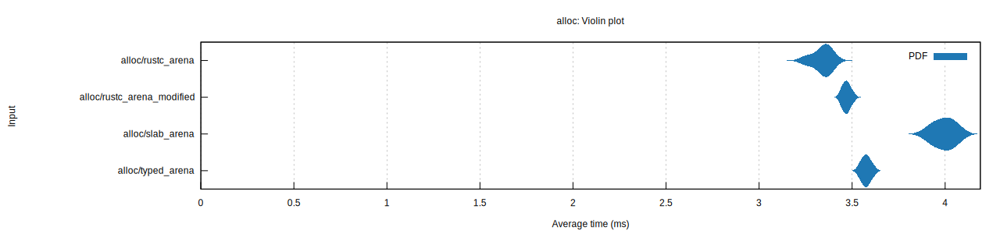
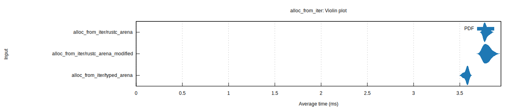
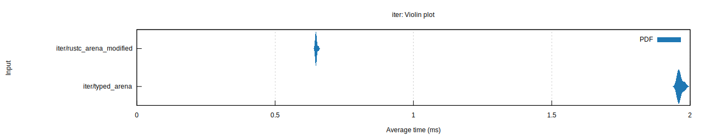
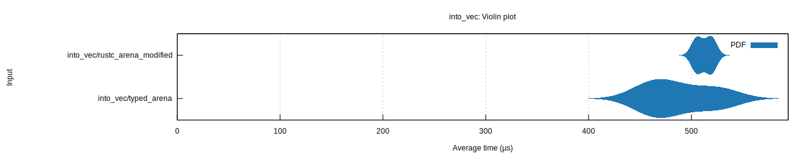

# rustc-arena-modified: rustc-arena ported to stable rust with additional features

## Why would you want this?

- Allocating objects in an arena can be faster then regular allocation
- An arena doubles as a collection where you can insert objects behind a shared reference. Instead of `Clone`ing objects and possibly using `Rc`s, use an `Arena` and copy the references.

### What about [`typed-arena`](https://crates.io/crates/typed-arena) and [`bumpalo`](https://crates.io/crates/bumpalo)?

- `rustc_arena_modified::TypedArena` allows coalescing and clearing objects behind a mutable reference, while saving the chunks so they don't need to be re-allocated. This is equivalent to calling `into_vec` and then converting the vector back into an arena, but faster, because you don't need to allocate anything.
- `rustc_arena_modified::TypedArena` is also significantly faster at iteration according to the benchmarks (other differences are negligible; see [benchmarks](#benchmarks))
- `rustc_arena_modified::TypedArena` returns a shared reference to allocated values, so it can iterate values behind a shared reference like [`typed-arena-nomut`](https://crates.io/crates/typed-arena-nomut). Unlike `typed-arena-nomut`, it can also be no-op converted between `rustc_arena_modified::TypedArenaMut`, which is the same but returns mutable references. And, you can get iterate mutable element references behind a mutable reference to even the shared arena, because that ensures there are no active shared references.
- The `slab` feature provides `SlabArena`, a wrapper for `rustc_arena_modified::TypedArena` which makes it keep track of freed elements in a linked list so their memory can be reclaimed. This comes with some drawbacks, like the inability to allocate slices in the free list (???: allow slice allocation, just make it not part of the free list?)
- TODO: Comparisons between `DroplessArena` and `Bump` (note: maybe `Bump` is objectively better)

## What is it?

A port of [`rustc_arena`](https://doc.rust-lang.org/stable/nightly-rustc/rustc_arena/index.html) into stable rust with the following new features:

- `TypedArena::iter` to iterate over all objects in the arena
- `TypedArena::retain` and `TypedArena::clear` to coalesce clearing objects behind a mutable reference, while saving the chunks so they don't need to be re-allocated.

## Benchmarks

[Full Report](criterion/report/index.html)

## License

Licensed under either of

* Apache License, Version 2.0 ([LICENSE-APACHE](LICENSE-APACHE) or http://www.apache.org/licenses/LICENSE-2.0)
* MIT license ([LICENSE-MIT](LICENSE-MIT) or http://opensource.org/licenses/MIT)

at your option.

Forked from [rustc-arena](https://doc.rust-lang.org/stable/nightly-rustc/rustc_arena/index.html) ([Github](https://github.com/rust-lang/rust/tree/master/compiler/rustc_arena)), which is also licensed under MIT "or" Apache 2.0.

### Contribution

Unless you explicitly state otherwise, any contribution intentionally submitted for inclusion in the work by you, as defined in the Apache-2.0 license, shall be dual licensed as above, without any additional terms or conditions.
